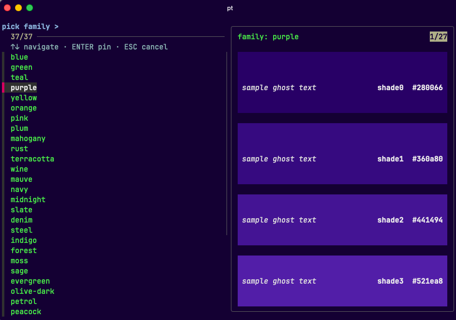
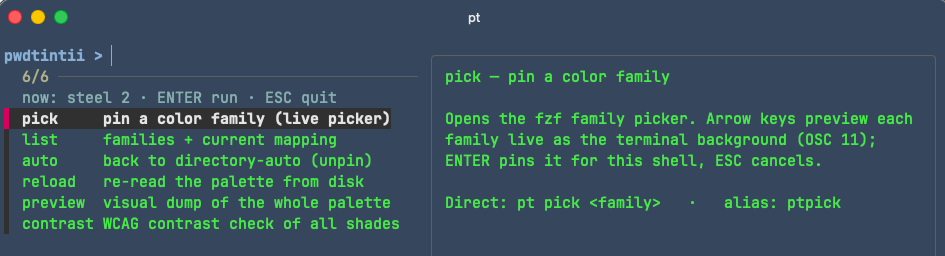

# pwdtintii

**Directory-derived terminal background tinting.** `cd` into a directory and the
background shifts to a color derived from it; every split/pane in the same dir
gets a distinct shade. Deterministic, no daemon, no persisted state,
terminal-agnostic via OSC 11.

Status: 0.5.0 · alpha · zsh + bash 4+ + fish 3.5+



## Why

Reading the path off a prompt is slow; color is instant. After a few days you
know the workspace by its tint and the split by its shade — related splits stay
visually related, unrelated repos stay distinct. It's per-workspace identity
color underneath whatever theme you run, not a theme itself.

## Install

Needs a terminal that honors OSC 11 (Ghostty, kitty, WezTerm, Alacritty,
iTerm2, modern xterm), **zsh**, **bash 4+**, or **fish 3.5+**, and
`shasum`/`sha1sum`. `fzf` is optional but powers the menus below (both degrade
to a printed list without it); `pt contrast` additionally needs `python3`.

```sh
git clone https://github.com/bmmmm/pwdtintii ~/.local/share/pwdtintii
```

**zsh** — add to `~/.zshrc`:

```zsh
source ~/.local/share/pwdtintii/pwdtintii.plugin.zsh
source ~/.local/share/pwdtintii/examples/aliases.zsh   # optional: pt + short aliases
```

**bash** — add to `~/.bashrc`:

```bash
source ~/.local/share/pwdtintii/pwdtintii.plugin.bash
source ~/.local/share/pwdtintii/examples/aliases.bash  # optional
```

**fish** (3.5+) — add to `~/.config/fish/config.fish`:

```fish
source ~/.local/share/pwdtintii/pwdtintii.plugin.fish
source ~/.local/share/pwdtintii/examples/aliases.fish  # optional: pt + short aliases
```

Note: the flat plugin file is not auto-loaded by fish plugin managers (fisher,
oh-my-fish) — use the manual `source` line above.

Open a fresh shell — the tint kicks in on the first prompt.

### Via a plugin manager

These source the zsh plugin automatically; bash users use the manual `source` line above.

**oh-my-zsh**
```zsh
git clone https://github.com/bmmmm/pwdtintii $ZSH_CUSTOM/plugins/pwdtintii
```
Then add `pwdtintii` to the `plugins=(...)` array in `~/.zshrc`.

**zinit**
```zsh
zinit light bmmmm/pwdtintii
```

**antidote** — add to `~/.zsh_plugins.txt`:
```
bmmmm/pwdtintii
```

## Usage

`pt` is the entry point. Run it bare for an fzf menu of the core actions, each
with a live description in the preview pane; pick one and it runs. The menu loops:
display-only actions return to it after a keypress (q quits), and ESC steps back
one level — out of the picker into the menu, out of the menu to the shell. After
you edit the plugin file, the next `pt` re-sources it automatically — your pinned
family, shade, and disabled state carry over — and prints a one-line notice, so
there is no manual re-source step.



| Command            | What it does |
|--------------------|---|
| `pt`               | the action menu |
| `pt pick [family]` | pin a family — fzf picker with live preview; `ctrl-t` toggles the dark/light group; a name pins directly |
| `pt view`          | browse the palette — fzf with a colored preview; `ctrl-t` cycles swatch/contrast × dark/light; read-only |
| `pt auto`          | unpin, back to directory-derived mode |
| `pt off`           | stop tinting and reset the terminal background (OSC 111) |
| `pt list`          | current key / family / shade, plus all families |
| `pt reload`        | re-read the palette TSV |
| `pt contrast`      | WCAG + APCA contrast check of every shade |
| `pt doctor`        | check OSC 11 support, fzf, and the palette |
| `pt help`          | this overview |
| `pt version`       | print the installed version |

Short aliases stay as direct accelerators: `ptpick ptlist ptreload ptview
ptcontrast`. Most commands also map to a `pwdtintii_*` function (e.g.
`pwdtintii_pick`, `pwdtintii_list`) callable without the aliases. The dispatcher
also accepts a few command aliases — `ls` (list), `unpin` (auto), `diag`
(doctor) — plus `pt apply` to force a re-tint of the current prompt.

## Configuration

Set before sourcing the plugin:

| Variable | Purpose |
|----------|---|
| `PWDTINTII_PALETTE`        | path to a custom palette TSV |
| `PWDTINTII_OVERRIDES_FILE` | TSV pinning `basename<TAB>family` (beats the hash) |
| `PWDTINTII_SHADES_DIR`     | per-dir PID-registry location |
| `PWDTINTII_DIR_KEY_FN`     | function resolving `$PWD` → key (default: git-root, else `~/<top>`) |

The palette is a TSV of `family` + four shades; 37 families ship by default. A
pale `light.tsv` variant (same families, dark-text-readable shades) ships
alongside it for light terminal themes: switch to it live in the picker with
`ctrl-t`, or make it the default by pointing `PWDTINTII_PALETTE` at
`~/.local/share/pwdtintii/palettes/light.tsv` before sourcing. See
[`palettes/README.md`](palettes/README.md) for the format.

## How it works

`$PWD` → a stable key (git-root, else first segment under `$HOME`) →
`shasum(key) % families` picks the family → a per-key PID registry hands each
shell a distinct shade → the background is set via `printf '\e]11;<hex>\a'`
(OSC 11), or via `tmux select-pane -P "bg=#..."` when running inside tmux so
each pane gets its own color instead of all panes sharing a single terminal
background. `pt off` resets to `bg=default` in tmux mode. It's re-applied from
`precmd` (zsh) / `PROMPT_COMMAND` (bash) / `fish_prompt` event (fish) and
released on exit; steady-state prompts in the same dir only re-emit, no
subprocess work.

## Development

```sh
tests/run.sh        # bats suite; bash, zsh, and fish kept behaviourally in lockstep
```

macOS `/bin/bash` is 3.2 — point the suite at a newer one with
`PWDTINTII_TEST_BASH=/opt/homebrew/bin/bash tests/run.sh`. CI runs shellcheck,
`zsh -n`, `fish -n`, and bats on every push.

## License

Apache-2.0 — see [LICENSE](LICENSE).
